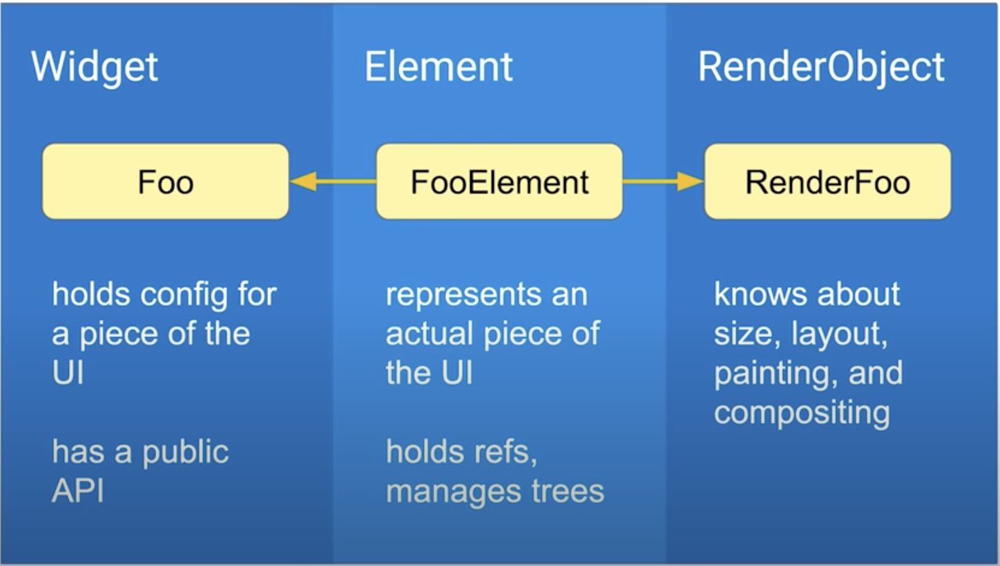

# How Flutter Renders Widgets?
> “Everything is a widget in Flutter”

Let’s see what the flutter document has to say about Widget in its official documentation .
> A widget is an **immutable** description of part of a User Interface.

how can User Interface be Immutable (unchangeable) as we all know that UIs are not at all immutable 
as we readily mutate different parts of our UIs by swapping pieces in|out by adding divergent widgets. 
So, If Widgets are Immutable then

#### So,How Does Flutter Manage State of your UI?, How represents change?
It actually manages this through with the help of 3 trees instead of a Singleton for the State Management.

> Flutter has three trees
* Widget Tree (Configure) -> Widget describes the configuration **for an element**.
* Element Tree (Lifecycle) -> Element: an instantiation of a widget at a perticular location in the tree. Element is mutable tree and it is managing life cycle of widets.
* RenderObject Tree (Paint) -> RenderObject: handles size, layout and painiting UI. When flutter draws ui, it doesn't look at tree of widgets. It looks at a tree of RenderObject.

**Flutter manage these 3 Different tree in for its rendering process:**

