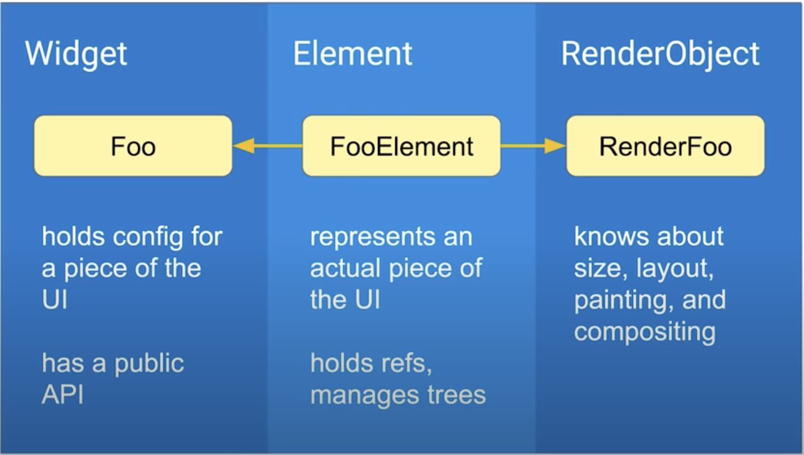
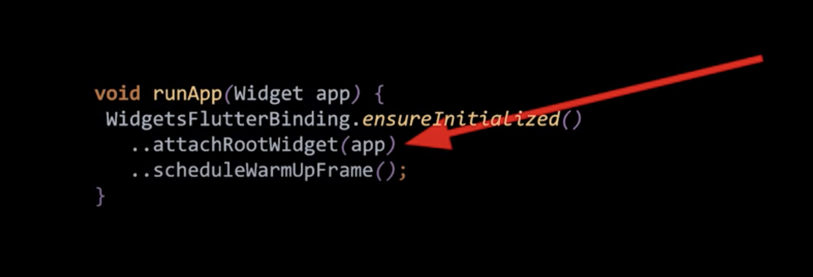
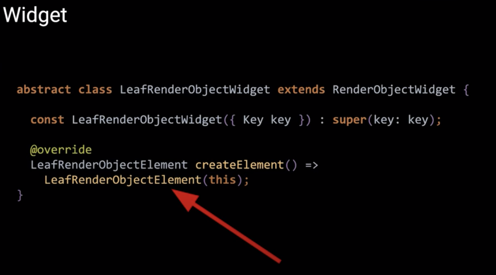
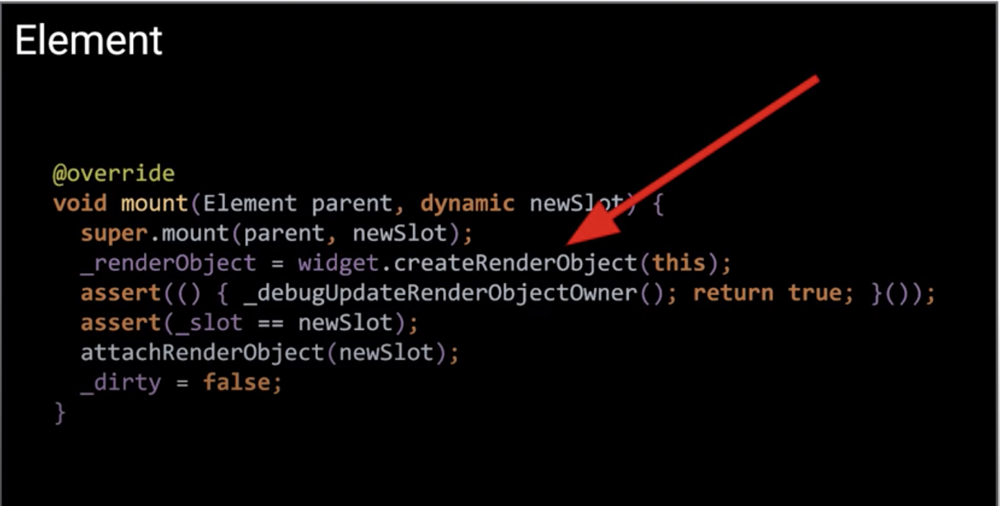
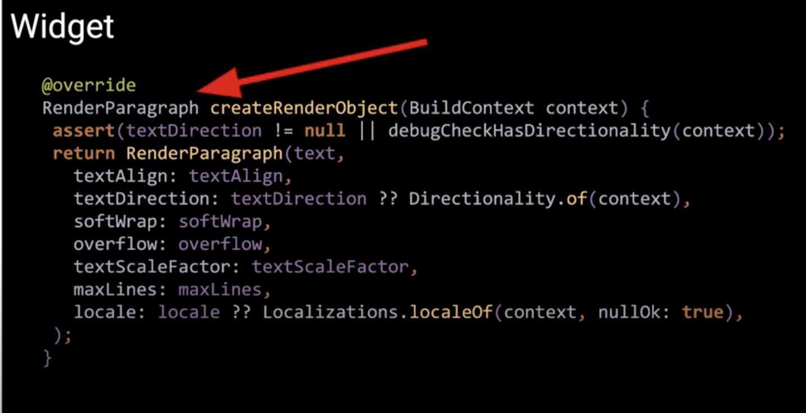
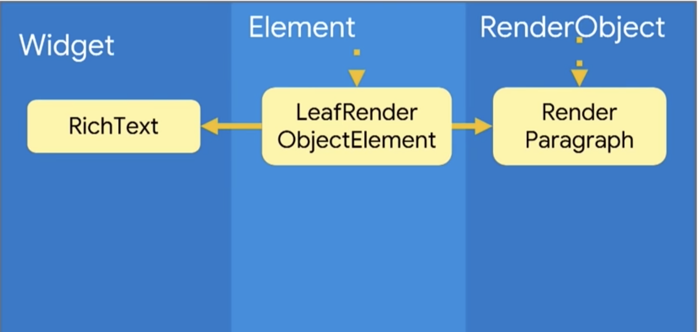
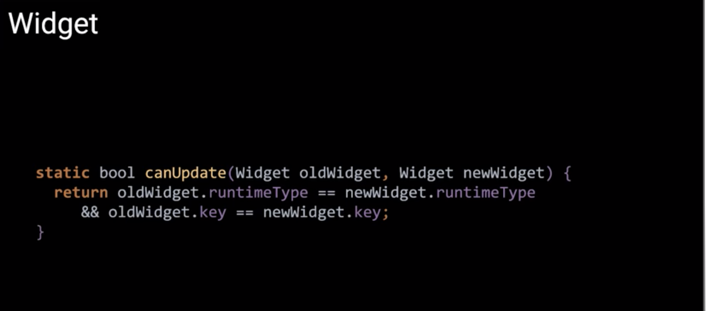
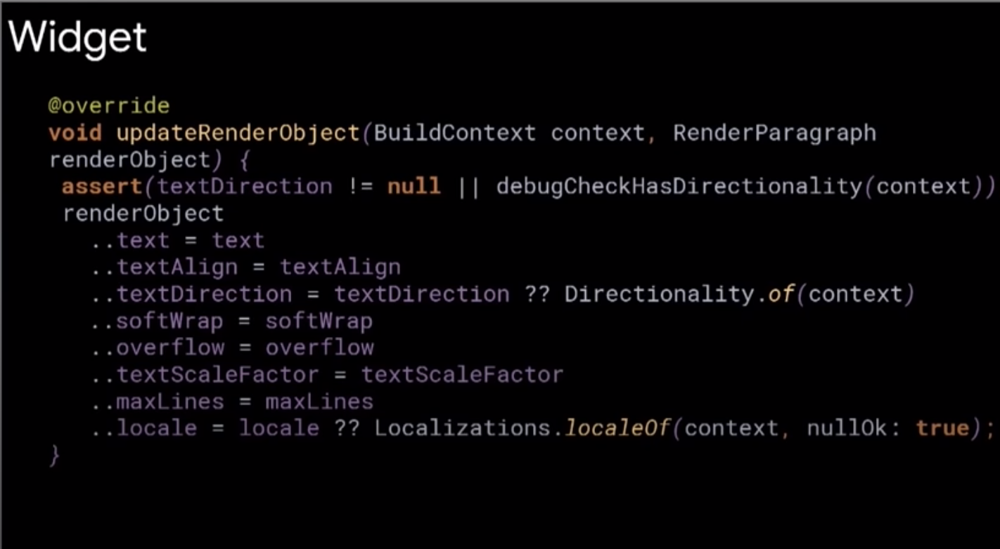

# How Flutter Renders Widgets?
> “Everything is a widget in Flutter”

Let’s see what the flutter document says about Widget in its official documentation.
> A widget is an **immutable** description of part of a User Interface.

How can User Interface be immutable(unchangeable), We readily mutate different parts of our UIs by swapping pieces in|out. 
So, If Widgets are Immutable then

#### How does flutter manage state of your UI? How does flutter represent changes?
It actually manages it through with the help of 3 trees.

> Flutter has three trees
* Widget Tree (Configure) -> Widget describes the configuration **for an element**.
* Element Tree (Lifecycle) -> Element: an instantiation of a widget at a perticular location in the tree. Element is mutable tree and it is managing life cycle of widets.
* RenderObject Tree (Paint) -> RenderObject: handles size, layout and painiting UI. When flutter draws UI, It doesn't look at tree of widgets. It looks at a tree of RenderObjects.

**Flutter manages these 3 different trees for its rendering process:**



So as already seen that a widget is immutable, and so that kind of makes sense because you are working with a **declarative framework** so you grasp what your UI is going to look like & configure it with widgets.
https://flutter.dev/docs/get-started/flutter-for/declarative

Widget describes configuration of an element, Elements are particularly an instantiation of those widgets. Elements manage updating and changing of the UI, controlling lifecycle of widgets. Lastly, we have a RenderObject which is what’s going to lay out and paint your UI.

**Why are flutter using 3 trees? Why not only widget tree?**

For this let's look at source code from flutter framework for when it create a flutter app.

Flutter app calls `runApp()` function initially:

It takes the Widget given by the runApp and put it at root of tree.



Widget then creates the `LeafRenderObjectElement`



Element then request creation of `RenderObject`



Passes all of the configuration needed to paint the widget.



Here is our tree.



Magic really happens when things change, This can be understood by setting 2 `runApp` function:

```
void main() {
  runApp(
    RichText(
      text: TextSpan(text: 'Hello world')
    ),
  );
  
  runApp(
    RichText(
      text: TextSpan(text: 'Hello devloper')
    ),
  );
}
```
Flutter realises it has done the stipulated amount of needed work so how it can reuse it. It will then call `canUpdate` method which can be performed when either : `runTimeType` or `keys` of widgets match.



After widget changes, elements are supoosed to update, Element calls `updateReanderObject` to update value of existing render object. Next time flutter paints UI using updated `RenderObject` tree, its going to paint new values,



We swapped one immutable widget tree to another immutable widget tree but we haven't created and distroyled anyting else, only updates.

The reason flutter has these three trees is because it helps to optimize the amount of work flutter need to do from one UI state to another. When you have deep trees or broad trees and you're changing different pieces of it. Flutter runs to same process and get next state of tree as quickly as possible and can perform least work to do.
